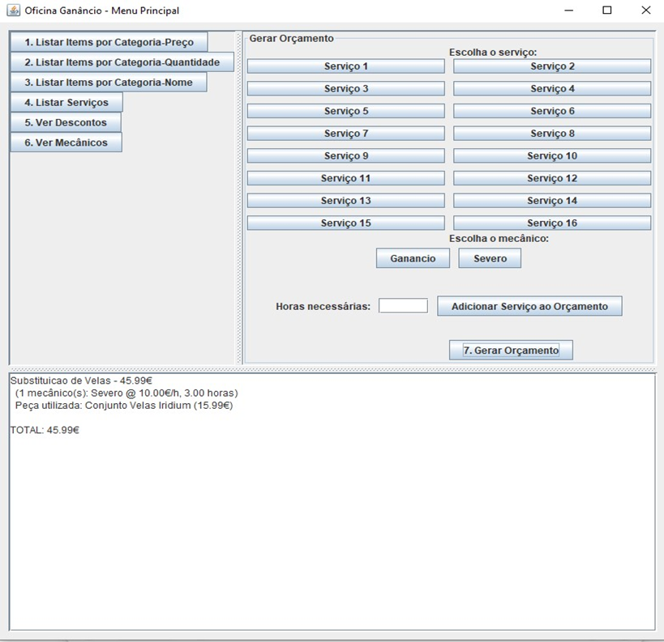
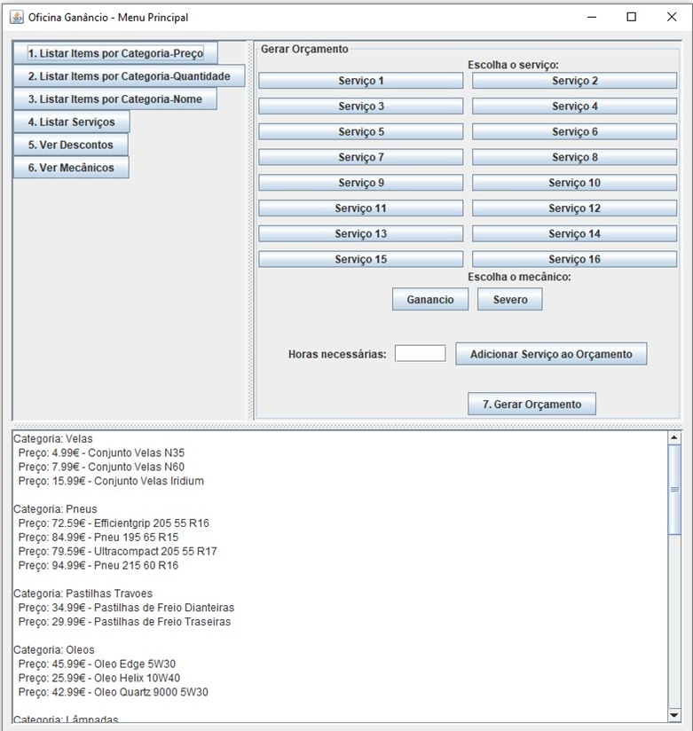

**\# Sistema de Gestão de Inventário e Orçamentos para Oficinas**

Este projecto implementa um sistema completo de \*\*gestão de inventário
e orçamentos\*\* para oficinas automóveis. A lógica de negócio é
desenvolvida em \*\*OCaml\*\*, enquanto a interface de utilizador é
construída em \*\*Java\*\*. Os dados do inventário e serviços estão
definidos num ficheiro base em \*\*Prolog\*\*.

{width="5.460416666666666in"
height="5.2868055555555555in"}

**\## Descrição Geral**

Este sistema tem como objetivo automatizar o processo de:

\- Listagem de peças em inventário, com ordenações por categoria, preço,
quantidade e nome.

\- Consulta de serviços disponíveis e mecânicos.

\- Cálculo de orçamentos com base nas peças mais lucrativas para cada
serviço.

\- Cálculo de mão de obra com aplicação de descontos baseados no tempo
de serviço.

\- Consolidação de um orçamento final, integrando peças, mão de obra,
custos fixos e descontos.

A integração entre OCaml e Java é feita através de execução de comandos
OCaml por parte da aplicação Java.

{width="5.206944444444445in"
height="5.49375in"}\-\--

**\## Estrutura do Projeto**

.

├── database.pl \# Base de dados em Prolog (peças, serviços, descontos,
mecânicos)

├── main.ml \# Código OCaml: leitura da base, cálculos, filtros

├── main_test_regex.ml \# Testes unitários OCaml (expressões regulares)

├── OficinaMenuGUI.java \# Interface gráfica (Swing)

├── IntegradorOCaml.java \# Integração Java ↔ OCaml

├── orcamento.txt \# Orçamento final gerado em ficheiro texto

└── README.md \# Este ficheiro

**\## Instruções de Compilação**

**\### Requisitos:**

\- OCaml 4.14.0 (via \[OPAM\](https://opam.ocaml.org/))

\- Java (JDK 11+)

\- Sistema operativo compatível com execução de binários OCaml
(Windows/Linux)

**\### 1. ACtivar ambiente OCaml (exemplo para PowerShell):**

powershell

(& opam env \--switch=4.14.0) -split \'\\r?\\n\' \| ForEach-Object {
Invoke-Expression \$\_ }

**2. Compilar os módulos:**

bash

ocamlc -o main.exe str.cma main.ml

javac \*.java

**Como Executar**

**Lançar a aplicação gráfica:**

bash

java -cp . OficinaMenuGUI

**Comandos alternativos no terminal:**

bash

./main.exe listar_items quantidade \# Ordenar por quantidade

./main.exe listar_items preco \# Ordenar por preço

./main.exe listar_items custo \# Ordenar por custo

./main.exe listar_servicos \# Listar serviços

./main.exe listar_descontos \# Ver descontos

./main.exe listar_mecanicos \# Ver mecânicos

Gerar orçamento (exemplo):

bash

./main.exe gerar_orcamento 1 1 0.5 3 2 1.5

Formato: \<serviço ID\> \<mecânico ID\> \<horas\> \...

**Funcionalidades**

Listagem detalhada do inventário com múltiplos critérios.

Interface gráfica simples e funcional para gestão de orçamentos.

Integração automática com ficheiro database.pl em formato Prolog.

SeleCção automática das peças mais rentáveis por categoria.

Aplicação de regras de desconto para marcas e tempo de mão de obra.

Geração de orçamento completo com totalização e exportação.

**Exemplos de Utilização**

O responsável da oficina seleciona um ou mais serviços.

Escolhe um mecânico e introduz o número de horas estimadas.

O sistema propõe as peças mais lucrativas, aplica descontos e apresenta
o orçamento total.

**Autor**

Projeto académico desenvolvido no contexto académico

**Licença**

Uso académico apenas. Não distribuído com fins comerciais.
